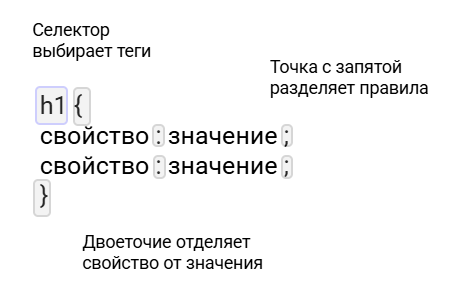
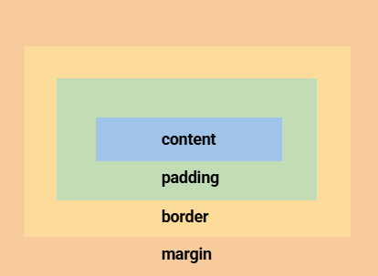
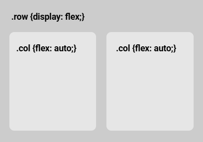

# CSS Основы

## Оглавление

- [Подключение стилей](#%D0%9F%D0%BE%D0%B4%D0%BA%D0%BB%D1%8E%D1%87%D0%B5%D0%BD%D0%B8%D0%B5-%D1%81%D1%82%D0%B8%D0%BB%D0%B5%D0%B9)
- [Селекторы](#%D0%A1%D0%B5%D0%BB%D0%B5%D0%BA%D1%82%D0%BE%D1%80%D1%8B)
- [Цвет и фон](#%D0%A6%D0%B2%D0%B5%D1%82-%D0%B8-%D1%84%D0%BE%D0%BD)
- [Шрифты](#%D0%A8%D1%80%D0%B8%D1%84%D1%82%D1%8B)
  - [Модель блока](#%D0%9C%D0%BE%D0%B4%D0%B5%D0%BB%D1%8C-%D0%B1%D0%BB%D0%BE%D0%BA%D0%B0)
- [Размеры](#%D0%A0%D0%B0%D0%B7%D0%BC%D0%B5%D1%80%D1%8B)
- [Границы и рамки](#%D0%93%D1%80%D0%B0%D0%BD%D0%B8%D1%86%D1%8B-%D0%B8-%D1%80%D0%B0%D0%BC%D0%BA%D0%B8)
- [Отступы и поля](#%D0%9E%D1%82%D1%81%D1%82%D1%83%D0%BF%D1%8B-%D0%B8-%D0%BF%D0%BE%D0%BB%D1%8F)
  - [Поля снаружи](#%D0%9F%D0%BE%D0%BB%D1%8F-%D1%81%D0%BD%D0%B0%D1%80%D1%83%D0%B6%D0%B8)
  - [Отступы внутри](#%D0%9E%D1%82%D1%81%D1%82%D1%83%D0%BF%D1%8B-%D0%B2%D0%BD%D1%83%D1%82%D1%80%D0%B8)
  - [Чтобы учитывать отступы в ширине](#%D0%A7%D1%82%D0%BE%D0%B1%D1%8B-%D1%83%D1%87%D0%B8%D1%82%D1%8B%D0%B2%D0%B0%D1%82%D1%8C-%D0%BE%D1%82%D1%81%D1%82%D1%83%D0%BF%D1%8B-%D0%B2-%D1%88%D0%B8%D1%80%D0%B8%D0%BD%D0%B5)
- [Сетка (flexbox)](#%D0%A1%D0%B5%D1%82%D0%BA%D0%B0-flexbox)
  - [CSS](#css)
  - [HTML](#html)
- [Пример кнопки](#%D0%9F%D1%80%D0%B8%D0%BC%D0%B5%D1%80-%D0%BA%D0%BD%D0%BE%D0%BF%D0%BA%D0%B8)
- [Пример формы](#%D0%9F%D1%80%D0%B8%D0%BC%D0%B5%D1%80-%D1%84%D0%BE%D1%80%D0%BC%D1%8B)

---

## Подключение стилей

```
html
<link rel="stylesheet" href="css/style.css">
```



## Селекторы

| HTML пример | CSS правило |
|--------------|-------------|
| ```html<br><h2>Заголовок тут</h2>``` | ```css<br>h2 { color: red; }``` |
| ```html<br><div class="myclass">Текст тут</div>``` | ```css<br>.class { font-weight: bold; }``` |

## Цвет и фон

```
background-color: fuchsia;   /* Фон любого блока */
color: #fc3;                 /* Цвет текста */
```
## Шрифты

```
font-family: Arial;               /* Какой шрифт */
font-size: 20px;                  /* Размер */
text-decoration: none / underline; /* Подчеркивание */
text-align: left / right / center; /* Выравнивание */
```

### Модель блока



## Размеры

| Свойство | Пример  | Описание |
| -------- | ------- | -------- |
| `width`  | `200px` | Ширина   |
| `height` | `200px` | Высота   |


## Границы и рамки

```
border-width: 1px;              /* Толщина */
border-style: solid / dotted / dashed; /* Стиль линии */
border-color: red;              /* Цвет линии */

/* Или */
border: 1px solid red;
```

## Отступы и поля

### Поля снаружи

```
margin-left: 10px;
margin-right: 10px;
margin-top: 10px;
margin-bottom: 10px;
```

### Отступы внутри

```
padding-left: 10px;
padding-right: 10px;
padding-top: 10px;
padding-bottom: 10px;
```

### Чтобы учитывать отступы в ширине

```
box-sizing: border-box;
```

## Сетка (flexbox)



### CSS

```
.row {
  display: flex;
}

.col {
  flex: auto;
}
```

### HTML

```
<div class="row">
  <div class="col">Я первая</div>
  <div class="col">Я вторая</div>
</div>
```
## Пример кнопки

```
a.button {
  color: white;
  background-color: #444;
  padding: 4px;
  margin: 16px;
  border-radius: 10px;
}
```

### Пример формы

```
input {
  border: 1px solid #ddd;
  padding: 8px 4px;
  border-radius: 10px;
  background-color: #eee;
}
```

